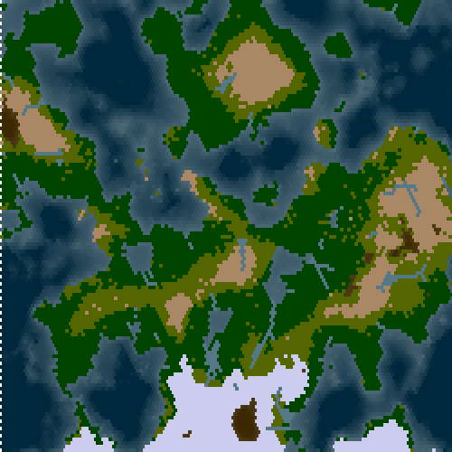

# A tiny terrain generator 

Made fo js1024 contest. Minified version is under 1k js.

Generates a realistic world map on hex or square grid. Includes simulation of humidity and erosion.

Based on a slightly simplified version of this https://github.com/baturinsky/worldgen algorithm. Read readme there for the details of algorithm.

# Links

Git: https://github.com/baturinsky/gen1k

Twitter: https://twitter.com/baturinsky

Post-compo version. Check out for some features that did not fit in 1k, like gradual map generation and 3d mode (will work on it on weekend after deadline):
https://codepen.io/baturinsky/pen/KKmZgBQ
